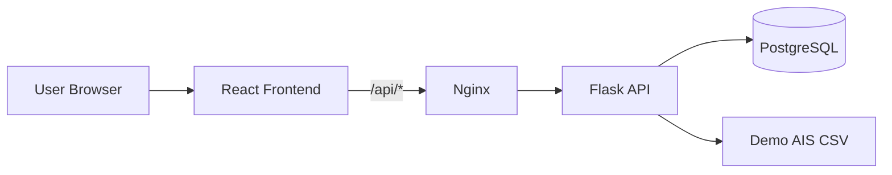
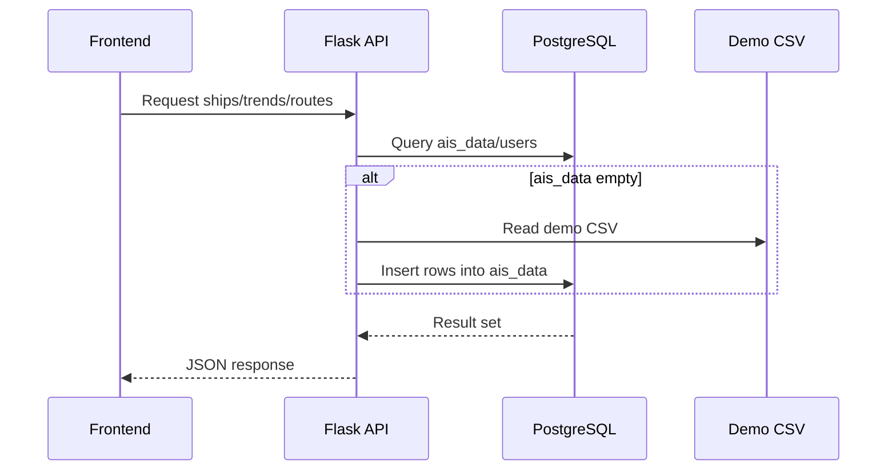

# Data Suite (AIS Maritime Intelligence Demo)

A full-stack maritime analytics demo platform for ship tracking, route analysis, traffic forecasting, and risk insights.

---

## What This Project Is

Data Suite is a modular demo system showing how maritime telemetry can be:

- Ingested into PostgreSQL
- Queried through Flask APIs
- Visualized in a React dashboard
- Extended with forecasting and risk workflows

It is designed for learning, prototyping, and product demos.

---

## Core Features

| Feature | Description | Status |
|---|---|---|
| Live Ship Map | Visualize latest vessel positions on interactive map | Available |
| Ship Profile and Route View | Fetch per-ship details and route tracks | Available |
| Trends Dashboard | Daily/hourly active ships and average speed metrics | Available |
| Traffic Forecasting | Date-based traffic and ARIMA speed forecasting | Available |
| Risk Forecasting | Proximity-based risk checks for selected vessels | Available |
| Authentication | Signup/signin with token-based auth flow | Available |
| PostgreSQL Backend | AIS-style records persisted in relational DB | Available |
| Dockerized Deployment | Multi-service setup via Docker Compose | Available |

---

## Tech Stack

| Layer | Technology |
|---|---|
| Frontend | React, Vite, Tailwind CSS, Leaflet, Chart.js |
| Backend | Flask, SQLAlchemy, Pandas, Statsmodels |
| Database | PostgreSQL 15+ |
| Infrastructure | Docker, Docker Compose, Nginx |

---

## Project Structure

```text
DataSuite-main/
|-- Frontend/                  # React + Vite client
|   |-- src/components         # UI modules (map, auth, dashboards)
|   |-- src/services           # API service wrappers
|   |-- src/styles             # Global + component styles
|-- backend/                   # Flask API + DB logic
|   |-- routes                 # API blueprints
|   |-- utils                  # DB loader utilities
|   |-- config.py              # App + DB bootstrapping
|   |-- app.py                 # Flask entrypoint
|-- docker-compose.yml         # Full stack orchestration
|-- nginx.conf                 # Reverse proxy + static hosting
|-- README.md
```

---

## System Architecture



---

## Data Flow



---

## Run Locally (Windows + PostgreSQL)

### 1) Backend `.env`
Create `backend/.env`:

```env
DATABASE_URL=postgresql+psycopg://postgres:<YOUR_PASSWORD>@localhost:5432/<YOUR_DB_NAME>
SECRET_KEY=replace-with-a-long-random-secret
```

### 2) Start PostgreSQL and create DB

```powershell
psql -U postgres -h localhost -d postgres
```

```sql
CREATE DATABASE aisdb_a;
\q
```

### 3) Run backend

```powershell
cd backend
python -m venv venv
.\venv\Scripts\Activate.ps1
pip install -r requirements.txt
python app.py
```

### 4) Run frontend

```powershell
cd Frontend
npm install
npm run dev
```

Frontend default URL: `http://localhost:5173`  
Backend URL: `http://localhost:5000`

---

## Run with Docker

```powershell
docker compose up --build
```

- App (Nginx): `http://localhost`
- API (proxied): `http://localhost/api/...`
- DB: `localhost:5432`

---

## Key API Surface

| Module | Endpoint Pattern | Purpose |
|---|---|---|
| Auth | `/api/auth/*` | Signup/signin/token verify |
| Ships | `/api/ships/*` | Latest ships, details, route |
| Trends | `/api/trends/*` | Daily/hourly metrics |
| Traffic | `/api/traffic/*` | Traffic and speed forecasts |
| Risk | `/api/riskforecast/*` | Proximity risk checks |
| Routes | `/api/routes/*` | CSV-backed route helper APIs |

---

## Demo Analytics Included

| Analytics Type | Method |
|---|---|
| Active ships/day | SQL grouping by date |
| Active ships/hour | SQL date_trunc |
| Avg speed/day/hour | SQL aggregations |
| Port arrivals | Destination counts |
| Speed forecast | ARIMA model |
| Proximity risk | Haversine distance threshold |

---

## Frontend Notes

- Auth background image is expected at:
  - `Frontend/public/auth-bg.jpg`
- If missing, auth screen falls back to gradient + overlay.

---

## Important Notes

- This repository is a demo implementation.
- Forecast outputs are illustrative and not operationally certified.
- Authentication is basic and should be hardened for production.
- Use production WSGI, secrets management, and migrations before real deployment.

---

## Contribution

1. Fork repository
2. Create feature branch
3. Commit changes
4. Open PR

---

## License

Choose and add your preferred open-source license (MIT/Apache-2.0/etc.).

---

## Summary

Data Suite is a feature-rich analytics tool through which you can visually analyze, represent, and manage different types of structured data chunks using dashboards, maps, forecasting modules, and API-driven workflows.
